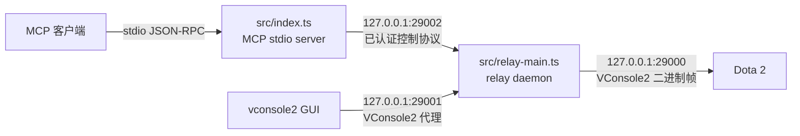
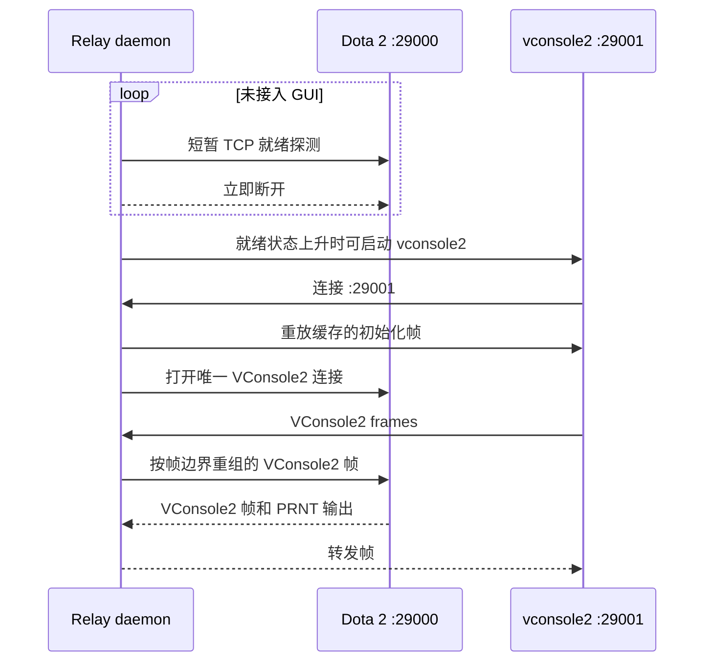
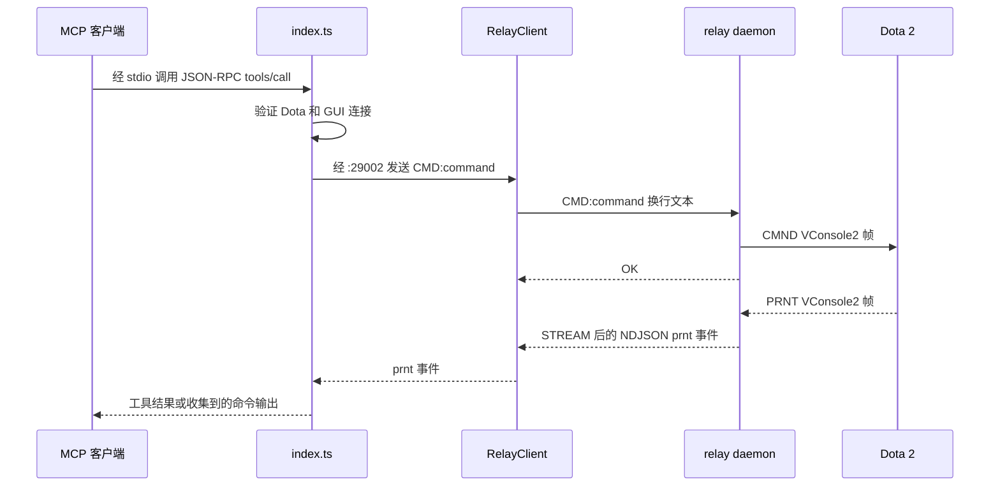

# 架构与设计

`dota2-mcp` 将支持 MCP 的 AI 客户端连接到本机正在运行的 Dota 2。它由 MCP stdio server 和长生命周期的本地 relay 组成，使多个 MCP 会话与官方 vconsole2 GUI 能共享 Dota 2 唯一的 VConsole2 连接。

## 目标与边界

- 让 MCP 工具访问实时 Dota 2 控制台命令和输出。
- AI 工具工作时，仍保留开发者可见的 vconsole2 工作流。
- 让并发 MCP 会话共享同一个 relay daemon。
- 动态检测 Dota 2，而不硬编码 addon 名称、地图或安装路径。
- 所有 relay 服务仅在本机提供。

MCP server 不会启动或终止 Dota 2，而是检测 Dota 的 VConsole2 监听器是否就绪。当 Dota 就绪、安装路径已知且启用了自动打开功能时，relay 可以启动 `vconsole2`，让它连接到 relay。

## 系统概览

正常运行时包含两个 Node.js 进程：

| 组件 | 职责 |
|---|---|
| `src/index.ts` | MCP stdio 入口。注册工具、接入 relay、执行控制台使用契约，并维护 MCP 侧的输出和状态缓冲。 |
| `src/relay-main.ts` | 独立 relay daemon 入口。初始化 `VConRelay`，配置 token 和空闲退出策略，然后启动本地监听器。 |
| `src/relay-client.ts` | daemon 模式下由 `index.ts` 使用的瘦客户端。经控制端口镜像 daemon 状态和事件。 |
| `src/tools/vcon-relay.ts` | 连接和生命周期协调器。代理 GUI、持有 Dota 连接、接收瘦客户端、广播数据并恢复连接。 |
| `src/tools/vcon-bridge.ts` | VConsole2 二进制客户端。编码命令并解析 Dota 的控制台帧。 |
| `src/daemon-utils.ts` | 通过本地锁、PID、token、日志、探测和 detached 进程辅助函数协调 relay 所有权。 |

daemon 通常将 `relay.lock`、`relay.pid`、`relay.token` 和 `relay.log` 存放在系统临时目录的 `dota2-mcp` 子目录中，必要时回退到用户主目录。token 用于阻止无关的本地进程连接 daemon 控制端口。

## 端口与协议边界

| 端点 | 协议 | 用途 |
|---|---|---|
| MCP 客户端到 `index.ts` | 基于 stdio 的 MCP JSON-RPC | 工具发现和调用。 |
| `127.0.0.1:29000` | Dota 2 VConsole2 二进制协议 | Dota 原生端点。Dota 一次仅允许一个 VConsole2 客户端。 |
| `127.0.0.1:29001` | VConsole2 二进制代理 | 面向 GUI 的 relay 端点。vconsole2 连接此处，而非直接连接 Dota。 |
| `127.0.0.1:29002` | 自定义换行分隔控制协议 | relay daemon 控制、状态读取、输出流和 MCP 瘦客户端命令注入。 |

`29002` 控制服务仅监听 loopback。daemon client 先发送 `HELLO <token>`，随后接收一行 JSON 格式的 `hello-ok` 响应，其中包含当前 Dota、GUI、addon 和地图状态；`RelayClient` 接着发送 `STREAM` 订阅异步事件。

请求是文本行，例如 `STATUS`、`CMD:<console command>`、`TAIL:<count>`、`FILTERS`、`SETFILTERS:<json-array>` 和 `SETMCPSUPPRESS:0|1`。响应与流式事件主要是 NDJSON 对象，包括 `status`、`prnt`、`adon` 和 `chan`；简单命令确认使用 `OK` 或 `ERR:` 文本行。token 错误时会收到 `hello-err`，随后 socket 被关闭。

面向 Dota 的连接使用已观测到的 VConsole2 帧：12 字节帧头后接 payload。relay 将命令编码为以空字符结尾的 `CMND` 帧，并解析 `PRNT`、`AINF`、`CHAN` 和 `ADON` 等帧。GUI 的 VConsole2 帧会在 relay 按帧边界重组后转发。

## 启动与 Relay 所有权

MCP server 启动时，`index.ts` 先检测 Dota 安装路径，再按以下顺序获取 relay：

1. 探测 `29002` 是否存在 daemon，读取其本地 token，并连接 `RelayClient`。
2. 没有可用 daemon 时，原子地获取 relay 锁，并以 detached 进程方式启动 `relay-main.js`。
3. 等待新 daemon 的控制端口可用，然后以瘦客户端连接。
4. 若另一个 MCP 进程持有锁，则等待该进程完成 daemon 启动后再连接。
5. daemon 协调全部失败时，创建进程内 `VConRelay` 作为降级方案。基础功能仍可用，但会退回单实例行为。

控制端口探测决定 daemon 是否就绪。PID 文件可辅助协调，但单独存在并不能证明 daemon 已完成初始化。

## VConsole 连接生命周期

`dotaReady` 和 `dotaConnected` 是刻意区分的两个状态：

- **Ready** 表示一次短暂 TCP 探测可以连接 Dota 的 `29000` 监听器。
- **Connected** 表示 relay 当前持有 Dota 唯一的 VConsole2 客户端连接。

没有 GUI 接入时，relay 不会持有 `29000`，而是周期性打开并立即关闭一个探测连接。状态转为 ready 时，若同时满足以下条件，可以自动启动 `vconsole2`：

- `DOTA2_VCON_AUTO_OPEN_VCONSOLE` 不为 `0`。
- 已检测到 Dota 安装路径。
- 没有已运行的 vconsole2 进程。
- 尚无 GUI 接入 relay。

vconsole2 接入 `29001` 后，relay 会：

1. 标记 GUI 已连接，并重放缓存的初始化帧，使晚接入的 GUI 获得通道、cvar、addon 和应用信息。
2. 取消所有进行中的就绪探测，防止它们与 Dota 唯一客户端槽位竞争。
3. 连接 Dota 的 `29000`，开始双向转发 VConsole2 帧。

GUI 断开后，relay 会立即关闭 Dota 连接并回到就绪探测模式。这会释放 `29000`，避免在无人观察控制台时继续占用 Dota 的唯一 VConsole2 槽位。

## MCP 请求与输出流

每个面向控制台的 MCP 工具都会先验证 Dota 和 GUI 是否已连接。要求 GUI 已接入是一项明确的产品契约：仅当开发者可以观察同一份实时控制台会话时，命令才可用。

在 daemon 模式下，`RelayClient` 将 `sendCommand()` 转换为 `CMD:` 文本行。daemon 可以为 `dota_launch_custom_game` 补全 addon 或地图，然后通过 Dota VConsole2 连接发送最终命令。Dota 的 `PRNT` 帧由 relay 解析、在本地发出事件，并广播给每个通过 `STREAM` 订阅的瘦客户端。

`index.ts` 维护独立的结构化与文本输出缓冲。需要命令结果的工具会在发送命令前订阅异步 `PRNT` 事件，并等待稳定期或超时。daemon 的 `TAIL` 命令读取 relay 侧的近期输出缓冲，其容量小于 MCP 进程的本地缓冲。

## 输出隔离

MCP 命令通常会被 `ai_disabled` 标记命令包裹。relay 将回显的标记行视为边界：

- 标记行不会进入 MCP 输出缓冲或 GUI。
- 标记行之间的输出仍可供 MCP 工具使用。
- 这些输出默认对 GUI 隐藏，避免在开发者控制台中显示大型 API dump 或面向机器的 JSON。

`console_gui_filter` 和 `SETMCPSUPPRESS` 控制命令可以修改此行为。GUI 发起的控制台活动和普通 Dota 输出仍会正常经过代理。

## 恢复与生命周期

relay 有多条相互独立的恢复路径：

| 情况 | 行为 |
|---|---|
| GUI 仍接入时 Dota 连接失败 | relay 短暂延迟后重试 Dota 连接。 |
| Dota 长时间静默 | relay 发送内部 echo 探针。未收到响应时关闭陈旧连接，并走正常重连逻辑。 |
| GUI 断开 | relay 立即关闭 Dota 连接，只恢复短暂的就绪探测。 |
| 瘦客户端失去 `29002` 连接 | `RelayClient` 使用有上限的指数退避重连，并维护有界的待发送命令队列。 |
| daemon 连接连续失败 | `index.ts` 丢弃当前瘦客户端并重新获取 relay，从而可启动替代 daemon。 |
| 没有 MCP 客户端、GUI 和 Dota 进程 | daemon 在空闲超时后退出。 |

relay 缓存的是初始化帧，而不是无界的 GUI 历史。因此，Dota 启动后才接入的 GUI 仍能获得初始化界面所需信息；近期文本控制台历史则由独立的输出缓冲管理。

## 运行时数据与信任模型

addon 和地图信息会优先从 Dota 的 `ADON` 帧中发现；已知 Dota 安装路径时，文件系统扫描作为降级方案。项目不携带静态 API 数据库：Lua、Panorama、CSS、事件、实体和 modifier 工具都通过控制台查询正在运行的引擎。

所有传输监听器都绑定到 loopback。`29002` 的 token 阻止未认证的本地进程向 daemon 注入控制台命令。token 保护 detached daemon 路径；进程内降级方案只在无法建立 daemon 协调时存在，不具备同样的多会话边界。
